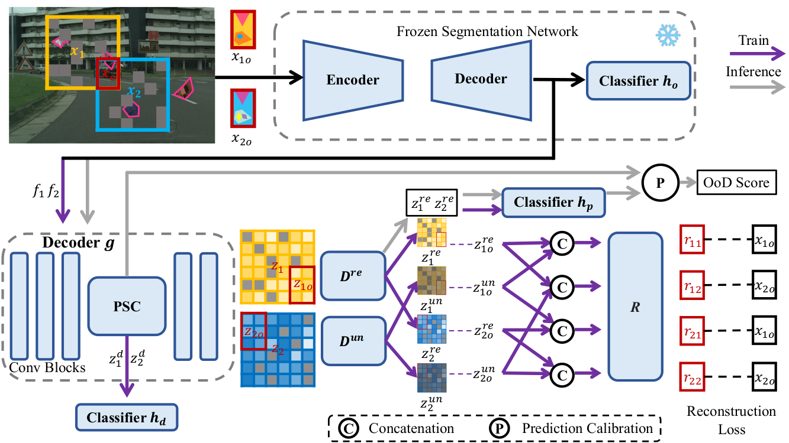
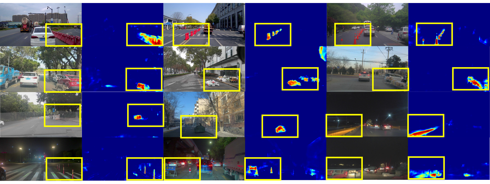
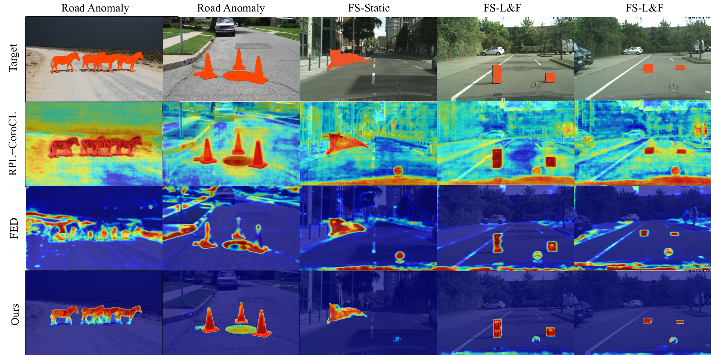

# Out-of-Distribution Semantic Segmentation with Disentangled and Calibrated Representation

**This repository is an official implementation of the paper "Out-of-Distribution Semantic Segmentation with Disentangled and Calibrated Representation", which is under review.** 

## [\[Paper\]](https://github.com/WanMotion ) | [\[Arxiv\]](https://github.com/WanMotion ) | [\[Supplementary\]](https://github.com/WanMotion)

## :fire: Highlight
- **An extra OoD data free Method**: Different from other outlier exposure method, our method synthesizes OoD data from ID data instead of another dataset, and achieves competitve performance.
- **A well-designed self-supervised training mechanism**: A disentangled representation learning via disentangling and reconstructing is introduced to guide the model to extract features of semantic-related and -unrelated to prevent overfitting to low diversity data.
- **An innovative cognitive discrepancy loss**: The likelihood of pixels being OoD is estimated by the cognitive discrepancy of two classifiers that learn and do not learn OoD data, to relieve the data noise.
- **Pixel-wise feature similarity calibration module**: The inaccurate feature similarity from the frozen branch is calibrated by the similarity from the new branch, with a fused-attention block, to further boosting the performance.

## :crown: Overview


Pixel-wise features extracted from the fixed segmentation network are first re-decoded by a decoder `g` and then disentangled into semantic-related and semantic-unrelated features. 
To guarantee the effectiveness of the disentanglement, semantic-related features are mixed with different semantic-unrelated features to reconstruct the original overlaps. 
When inferencing, the OoD score map is calculated directly by the classifier `hp` without being reconstructed. 

## :art: Real-world Visualization on CODA

To demonstrate the generalization capability of our method, we test our model trained on the Cityscapes dataset directly on the [CODA](https://coda-dataset.github.io/ "CODA") dataset. The visualization results reveal compelling performance in scenes with large domain shifts.


## :art: Visualization on Fishyscapes and Road Anomaly compared with other methods

From the visualization, our method performs well producing clear and precise predictions in scenes with both few and large domain shifts.


## Setup Environment
For install and data preparation, please refer to the guidelines in [MMSegmentation v1.0.0](https://github.com/open-mmlab/mmsegmentation/tree/v1.0.0 "MMSegmentation").
An example (works for us): `CUDA 10.2`, pytorch `1.12.1`, mmengine `0.7.4` and mmcv `2.0.1`. We also provide the [requirements.txt](./requirements.txt) for reference.

The directory tree of the data folder is as follows：

```
data
├── cityscapes
│   ├── gtFine
│   │   ├── test
│   │   ├── train
│   │   └── val
│   └── leftImg8bit
│       ├── test
│       ├── train
│       └── val
├── fishyscapes
│   ├── LostAndFound
│   │   ├── annotations
│   │   └── images
│   └── Static
│       ├── annotations
│       └── images
├── road_anomaly
     ├── annotations
     │   └── val
     └── images
         └── val
```

## :dart: How to train
Before training, please download the model weights pretrained on Cityscapes to the folder `pretrain`. [Here is the link.](https://github.com/open-mmlab/mmsegmentation/tree/v1.0.0/configs/segformer )

Train with a single GPU:
```shell
python tools/train.py local_configs/segformer/b5_disentangle.py
```
Train with more than one GPU:
```shell
bash tools/dist_train.sh local_configs/segformer/b5_disentangle.py 2
```
## :dart: How to Test
If you want to evaluate on the specific dataset, for example, Road Anomaly:
```shell
python tools/test.py local_configs/OoDTest/road_anomaly.py path/to/your/checkpoint
```

## :cat: Performance

Performance on Fishyscapes Validation Set and on Road Anomaly:

| **Dataset**  | **AuROC** | **AuPRC** | **FPR95** |
|--------------|-----------|-----------|-----------|
| FS-L&F       | 98.89     | 69.85     | 5.78      |
| FS-Static    | 99.59     | 90.93     | 0.73      |
| Road Anomaly | 95.79     | 74.04     | 20.82     |

Performance on Fishyscapes Test Set:

| **Dataset** | **AuPRC** | **FPR95** |
|-------------|-----------|-----------|
| FS-L&F      | 59.37     | 6.62      |
| FS-Static   | 96.31     | 0.63      |


## Acknowledgement
This project references the following open-source projects. 
We thank their authors for making the source code publically available.
- [SegFormer](https://github.com/NVlabs/SegFormer)
- [MMSegmentation](https://github.com/open-mmlab/mmsegmentation)
- [SETR](https://github.com/fudan-zvg/SETR)
- [PSPNet](https://github.com/hszhao/PSPNet)
- [DeepLabV3+](https://github.com/tensorflow/models/tree/master/research/deeplab)

## Citation
To be updated.
